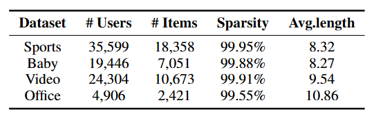

# FAESRec

**Frequency-Adaptive Encoder for Sequential Recommendation (FAESRec)​** is a novel framework that addresses limitations in sequence encoder by introducing three core innovations: a Frequency-Adaptive Mixture-of-Experts layer (FAMoE) for end-to-end spectral decomposition with learned boundaries, adaptive global/local filters (FAFe) for denoising and re-weighting spectral components, and a probabilistic contrastive learner (FSaCL) that synthesizes semantically coherent frequency-domain views while theoretically preserving mutual information, achieving up to 103.57% HR@1 and 19.68% NDCG@5 improvements over state-of-the-art baselines across four benchmarks.


<p align="left"><b>Figure&nbsp;1</b> The architecture of the FAESRec.</p>

The architecture of FAESRec, as illustrated in Figure 1, primarily encompasses three key components: (1) end-to-end spectral decomposition with learned boundaries, (2) denoising and re-weighting of spectral components, and (3) frequency-adaptive contrastive learning.


## 1. Experimental Setting

### 2.1 Datasets

#### 2.1.1 Sources  

Download datasets from [RecSysDatasets](https://github.com/RUCAIBox/RecSysDatasets) or their [Google Drive](https://drive.google.com/drive/folders/1ahiLmzU7cGRPXf5qGMqtAChte2eYp9gI). And put the files in `./dataset/` like the following.

```
$ tree
.
├── Amazon_Sports
│   ├── Amazon_Sports.inter
├── Amazon_Video_Games
│   ├── Amazon_Video_Games.inter
├── Amazon_Baby
│   ├── Amazon_Baby.inter
└── Amazon_Office_Products
    ├── Amazon_Office_Products.inter
```


#### 2.1.2 Statistics  

Dataset statistics are summarised in **Table&nbsp;1**.

<p align="left"><b>Table&nbsp;1</b> Statistics of datasets.</p>




### 2.2 Baseline Models 
We compare FAESRec with ten state-of-the-art models, including transformer-based models: **SASRec (ICDM, 2018)**, **BERT4Rec (CIKM, 2019)**, **LinRec (SIGIR, 2023)**; SSM-based models: **Mamba4Rec (RelKD, 2024)**, denoted as Mamba, **ECHOMamba4Rec**, denoted as
ECHO, **SIGMA (AAAI, 2025)**;  frequency-based models: **FMLPRec (WWW, 2022)**, **FEARec (SIGIR, 2023)**; contrastive learning based models: **DuoRec (WSDM, 2022)**,  **CFIT4Rec (RecSys, 2023)**, denoted as CFIT.

---

## 3. Result Reproduction

### 3.1 Environment  

```bash
pip install -r requirements.txt
```

### 3.2 Training & Evaluation  

Example scripts (`./experiments/`):

```bash
bash ./experiments/Amazon_Baby.bash
```

---


